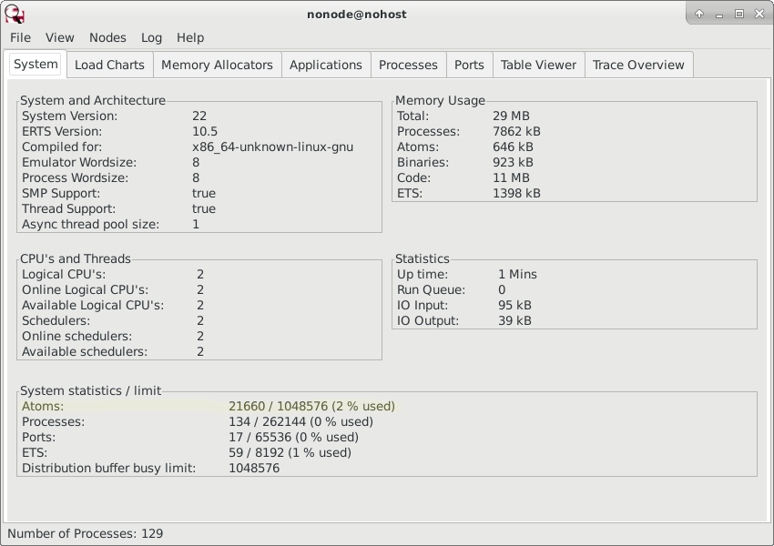

<h1>Unit 2: Forms with validation and redirection</h2>

The way I've structured these tutorials is you don't need to do `rebar3 new release unit2`, but rather just add
what's new here to your existing release. That way your computer won't have to download and build Cowboy again
when you enter `rebar3 release`. Just remember to change `unitX` in the code to whatever you have called your
project.

I've separated the units to keep each one small and simple.

If you are starting afresh with `rebar3 new release unit2`, step1 is add cowboy as a dependency in 
<a href="https://github.com/roblaing/erlang-webapp-howto/blob/master/unit2/rebar.config">rebar.config</a> 
and to the applications list in 
<a href="https://github.com/roblaing/erlang-webapp-howto/blob/master/unit2/apps/unit2/src/unit2.app.src">apps/unit2/src/unit2.app.src</a>
as described in <a href="https://github.com/roblaing/erlang-webapp-howto/tree/master/unit1">Unit 1</a>.

<h2>Templating</h2>

We now move from static to dynamic content, which involves string substitutions &mdash; something with lots of gotchas in Erlang which I'll
warn about here.

Generating dynamic HTML has spawned many templating systems, and Erlang programers have a wide choice.
<a href="https://github.com/mojombo/mustache.erl">Mustache</a>,
<a href="https://github.com/erlydtl/erlydtl">Django Template Language</a>,
and 
<a href="https://github.com/filippo/sgte">StringTemplate</a> are some I found with a quick Google search.

If you are familiar with one of these templating systems, simply add it with cowboy as a dependency. I don't use templates much, so am
just going to use this two-line function as my templating system:

```erlang
-spec template(FileName :: file:filename(), ArgList :: [string()]) -> Html :: binary().
%% @doc Reads an html file from its complete path name, and inserts strings without escaping `<' or `>'.
template(FileName, ArgList) ->
  {ok, Binary} = file:read_file(FileName),
  io_lib:format(Binary, ArgList).
```

I generally try to follow the recipe taught by MIT's free
<a href="https://htdp.org/2019-02-24/part_preface.html#%28part._sec~3asystematic-design%29">How to design programs</a> textbook
which teaches you to write down a <em>signature</em> (equating to the -spec line) and a <em>purpose statement</em>
(equating to the %% @doc ... line) before starting to code. This helps making it clear in your mind what your
function is going to produce and consume, and reminds you not to break its <em>contract</em> with existing code that uses
it when you rewrite it.

The `-spec ...` line is optional, but vital in my opinion to make your software decipherable. It virtually has a language of 
its own explained in the
<a href="https://erlang.org/doc/reference_manual/typespec.html">Types and Function Specifications</a> chapter of the official
documentation.

<h3>Modules</h3>

The template/2 function is the first of many auxiliary functions common to the `foo_handler.erl` files that will grow as my
project expands. I'm going to put these helpers in a separate module
<a href="https://github.com/roblaing/erlang-webapp-howto/blob/master/unit2/apps/unit2/src/webutil.erl">
apps/unit2/src/webutil.erl</a>.

The top of my module must include `-module(<ModuleName>)` (which must match the filename `<ModuleName>.erl`) and the functions I want to make
public must be included in `-export(FunctionsList)` with the name of the function fullowed by `/` and the number of arguments
it expects (arity to its friends). Unlike Prolog, zero arity functions in Erlang still require brackets as in foo().

```erlang
%% @doc Helper functions for my simple templating system.
-module(webutil).
-export([template/2]).
```

As the number of helper functions grows, I need to remember to add them to the export list
```erlang
-export([ template/2
        , html_escape/1
        ]).
```

I can then use these functions in other modules with Erlang's `Module:Function(...)` convention,
eg `webutil:template("/var/www/index.html", ["Hello", "World"])`.

Running `rebar3 edoc` will create a new subdirectory `apps/unit2/doc/` with an `index.html` file which you can simply load
with Ctrl-O. The home page is made from an optional `apps/unit2/doc/overview.edoc` file explained in the
<a href="http://erlang.org/doc/apps/edoc/chapter.html">EDoc</a> documentation. For some reason, rebar3 does not include the doc/ subdirectory
and its contents in its `_build` tree, so you need to remember to copy that yourself if you intend writing software useable by
other people.

<h3>The beauty of keeping HTML HTML</h3>

The file loaded by webutil:template/2 from FileName is a standard HTML file with <code>~s</code> written wherever I want to create a <em>hole</em>
to be filled by substituting a string from ArgList. The strings in ArgList have to be exactly in the order of <code>~s</code> and 
the length of ArgList has to match the number of tilde <em>esses</em> in the html file loaded.

For Prolog programers, Erlang's <a href="https://erlang.org/doc/man/io_lib.html#format-2">format/2</a> function will be familiar,
and for C-family programers, it's nearly identical to the <code>printf</code> function except it uses tildes instead of percentage signs to mark
what in a string is to be substituted.

Here is an <a href="https://github.com/roblaing/erlang-webapp-howto/blob/master/unit2/apps/unit2/priv/form.html">html form</a> using my 
templating method based on Mozilla's <a href="https://developer.mozilla.org/en-US/docs/Learn/Forms/Your_first_form">
Your first form</a> tutorial.

```html
<!DOCTYPE html>
<html>
  <head>
    <meta charset="utf-8" />
    <title>Your first HTML form, styled</title>
    <link rel="stylesheet" href="/styles/form.css">
  </head>
  <body>
    <form method="post">
      <ul>
        <li>
          <label for="name">Name:</label>
          <input type="text" id="name" name="user_name" value="~s"/>
          <span class="error">~s</span>
        </li>
        <li>
          <label for="mail">E-mail:</label>
          <input type="email" id="mail" name="user_mail" value="~s"/>
          <span class="error">~s</span>
        </li>
        <li>
          <label for="msg">Message:</label>
          <textarea id="msg" name="user_message">~s</textarea>
          <span class="error">~s</span>
        </li>
        <li class="button">
          <button type="submit">Send your message</button>
        </li>
      </ul>
    </form>
  </body>
</html>
```

To a text editor or linter like <em>tidy</em> the above looks exactly like HTML, which I've found to be a huge advantage.
A reason my SWI Prolog version of this tutorial petered out before becoming a fully fledged blog is I made the mistake of 
using its HTML generating tools, resulting in ugly, unmaintainable code embedded in Prolog, which produced
equally ugly HTML.

While you do need to protect your site from malicious user input, that's easily done in HTML by translating `<` to `&lt;` and 
`>` to `&gt;` before inserting strings into the layout template. I'll cover this in Unit 3, along with escaping single quotes in SQL.

<h3>Quick warning about Erlang's text traps</h3>

Text in Erlang can be one of three things:

  1. Double quoted "Hello World" is under the hood a list of character codes [72,101,108,108,111,32,87,111,114,108,100]. 
     Since it's a list, you can concatenate these using Erlang's "Hello " ++ "World" notation.
  2. Single quoted 'Hello World' is an atom, and cannot be concatenated unless converted by <code>atom_to_list('Hello World')</code>
     first. The <a href="http://erlang.org/doc/efficiency_guide/commoncaveats.html">Common Caveats</a> section of the official 
     documentation advises against converting the other two text types to atoms without good reason, 
     which I'll expand on quickly in <em>Introducing Observer</em>.
  3. Chevroned <<"Hello World">> is a <a href="https://erlang.org/doc/reference_manual/data_types.html#bit-strings-and-binaries">binary</a>.
     This is the format that <a href="https://erlang.org/doc/man/file.html#read_file-1">file:read_file("form.hml")</a> returns the HTML in
     form.html as, and also how Cowboy sends and receives http headers and bodies, which is apparently more efficient than traditional text.

I've found the <code>io_lib:format(Template, [Arg1, Arg2, Arg3, ...])</code> function a huge boon because <code>Template</code> can be any
of these three types, as can each Arg in the Arglist, with all the type conversion you would need
to do if you wanted to laboriously concatenate strings happening automagically.

One snag was I initially used `~w` instead of `~s` since it's more commonly used in Prolog's
<a href="https://www.swi-prolog.org/pldoc/doc_for?object=format/2">format/2</a> statement, which caused the input to get rendered
in my HTML as `[72,101,...]`. Next I tried `~p`, which caused the surrounding double quotes, single quotes, or chevrons to be retained
in the HTML output.

Mercifully, `~s` appears to be the correct magic incantation, and so far appears to be working well.

<h2 id="observer">Introducing Observer</h2>

One of the tools bundled with OTP is <a href="https://erlang.org/doc/apps/observer/users_guide.html">observer</a>
which seems to be a relatively recent addition. The O'Reilly books on Erlang and OTP that I've been using to help me write
these tutorials refer to <em>monitor</em> and <em>tv</em> (short for table viewer) which have been removed from newer versions and replaced
with observer.

To use observer, run `rebar3 shell` in your project root directory, which takes you to the erl command line after loading the application. 
I found I needed to hit enter to get to a `1>` command line.

At the command line, enter `observer:start().` which should launch a GUI app on your desktop which looks something like this:



The <em>System</em> tab, the default opening page, has an entry <em>Atoms</em> in the <em>System statistics / limit</em> box
which I've attempted to highlight in the above screen shot,
but my Gimp skills aren't that great. This says 2% of the available atoms have been used.

The <a href="http://erlang.org/doc/efficiency_guide/commoncaveats.html#list_to_atom-1">list_to_atom/1</a> entry in the Efficiency Guide
warns:

<q>Atoms are not garbage-collected. Once an atom is created, it is never removed. The emulator terminates if the limit for the number of atoms (1,048,576 by default) is reached. Therefore, converting arbitrary input strings to atoms can be dangerous in a system that runs continuously.</q>

Observer provides a lot of information helpful for debugging and optimising, which I hope to become more familiar with in due
course.

<h2>Adding routes</h2>

<a href="https://github.com/roblaing/erlang-webapp-howto/blob/master/unit2/apps/unit2/src/unit2_app.erl">unit2_app.erl</a> is nearly identical to
<a href="https://github.com/roblaing/erlang-webapp-howto/blob/master/unit1/apps/unit1/src/unit1_app.erl">unit1_app.erl</a>
except we add two new routes conforming to the pattern <code>{PathMatch, Handler, InitialState}</code>:

```erlang
     [ ...
     , {"/form", form_handler, ["","","","","",""]}
     , {"/welcome/:name", welcome_handler, []}
     ]
```

Note the `InitialState` I'm passing to my form_handler is the six arguments needed to fill the `~s` holes in my form.html with
empty strings initially.

Next we need to create two new modules in <code>apps/unit2/src</code> called 
<a href="https://github.com/roblaing/erlang-webapp-howto/blob/master/unit2/apps/unit2/src/form_handler.erl">form_handler.erl</a> and 
<a href="https://github.com/roblaing/erlang-webapp-howto/blob/master/unit2/apps/unit2/src/welcome_handler.erl">welcome_handler.erl</a>.
 
A drawback of using rebar3 instead of Cowboy-aligned erlang.mk is there is no `make new t=cowboy.http n=hello_handler` to create a skeleton
file.

The key things are a Cowboy handler needs to have <code>-behaviour(cowboy_handler).</code> and
<code>-export([init/2]).</code> (which should be explained in the
<a href="https://ninenines.eu/docs/en/cowboy/2.2/guide/handlers/">handlers</a> section of its User Guide, but
seems to be missing):

```erlang
-module(foo_handler).
-behaviour(cowboy_handler).

-export([init/2]).
```

A skeleton init function looks like:

```erlang
init(Req0, State) ->
  Req = cowboy_req:reply(200,
    #{ <<"content-type">> => <<"text/html; charset=UTF-8">>
     },
    <<"Hello World">>,
    Req0
  ),
  {ok, Req, State}.
```

<h3>Form logic</h3>

Typically with a web form you want to validate the user input, and if it is correct, redirect the user to a <em>success page</em>
&mdash; with URL <code>http://localhost:3030/welcome/John Smith</code> or whatever port number and user name &mdash;
but if there are missing or wrong answers, back to the form with hints on what needs to be done, and the original inputs held
so as not to force the exasperated user to start from scratch.

This is pretty basic stuff, which many web application frameworks make impossible, (the inets library which comes with OTP for instance).

Luckily, Cowboy makes this all fairly easy. It also has a nifty <em>permalink</em> very similar to Google app engine, which is the one
I'm most familiar with from doing the Udacity web development course given by Reddid founder Steve Huffman a few years ago that
I've borrowed a bit from for these tutorials.

<h4>Welcome page</h4>

I'm starting at the <em>end</em> page since it's simpler than the form handler, and illustrates permalinks.

As explained in the <a href="https://ninenines.eu/docs/en/cowboy/2.2/guide/routing/">routing</a> section of the Cowboy
User Guide, directory names prefixed with a colon as with <code>"/welcome/:name"</code> become variable names.

It is also worth looking at what is inside Cowboy's <a href="https://ninenines.eu/docs/en/cowboy/2.2/guide/req/">Req0</a> 
variable that a cowboy_handler's <code>init(Req0, State)</code> receives.

If I enter the URL <code>http://localhost:3030/welcome/John Smith</code>, the above <em>PathMatch "/welcome/:name"</em> sends a
nested map to the 
<a href="https://github.com/roblaing/erlang-webapp-howto/blob/master/unit2/apps/unit2/src/welcome_handler.erl">
welcome_handler</a> which looks like this:

```erlang
#{bindings => #{name => <<"John Smith">>},
  body_length => 0,cert => undefined,has_body => false,
  headers =>
      #{<<"accept">> =>
            <<"text/html,application/xhtml+xml,application/xml;q=0.9,*/*;q=0.8">>,
        <<"accept-encoding">> => <<"gzip, deflate">>,
        <<"accept-language">> => <<"en-US,en;q=0.5">>,
        <<"connection">> => <<"keep-alive">>,
        <<"host">> => <<"localhost:3030">>,
        <<"upgrade-insecure-requests">> => <<"1">>,
        <<"user-agent">> =>
            <<"Mozilla/5.0 (X11; Linux x86_64; rv:60.0) Gecko/20100101 Firefox/60.0">>},
  host => <<"localhost">>,host_info => undefined,method => <<"GET">>,
  path => <<"/welcome/John%20Smith">>,path_info => undefined,
  peer => {{127,0,0,1},48270},
  pid => <0.531.0>,port => 3030,qs => <<>>,ref => my_http_listener,
  scheme => <<"http">>,
  sock => {{127,0,0,1},3030},
  streamid => 2,version => 'HTTP/1.1'}
```

Extracting "John Smith" from this involves first getting the value of <code>bindings</code> from Req0 by calling
<code>maps:get(bindings, Req0)</code> which returns the map <code>#{name => <<"John Smith">>}</code>, which I then
have get the value of <code>name</code> from.

I initially nested `maps:get/2` functions to extract `Name = maps:get(name, maps:get(bindings, Req0))` since I found
Erlang's pattern matching for maps rule a bit confusing. Once I grasped that all you need to do is substitute `:=` for
`=>` it became clear to me. A cool thing about Prologis languages is you can extract what you want from compound data
by simply using the original as a template and putting upper case variable names where you want to get values.

```erlang
init(Req0, State) ->
  #{bindings := #{name := Name}} = Req0,
  ...
```

In this case, Name is now the binary <code><<"John Smith">></code> which <code>io_lib:format(Template, Args)</code> can handle.
I've used two <code>~s</code> in 
<a href="https://github.com/roblaing/erlang-webapp-howto/blob/master/unit2/apps/unit2/priv/welcome.html">
welcome.html</a>, once in the title and once in the body:

```html
<!DOCTYPE html>
<html>
  <head>
    <meta charset="utf-8" />
    <title>~s's Home Page</title>
    <link rel="stylesheet" href="/styles/form.css">
  </head>
  <body>
    <h1>Welcome ~s!</h2>
  </body>
</html>
```
This means I need to remember to use my Name variable twice in the Args list my template/2 function passes to io_lib:format/2:

```erlang
  ...
  Content = webutil:template(code:priv_dir(unit2) ++ "/welcome.html", [Name, Name]),
  ... 
```

Note the above 
<a href="https://erlang.org/doc/man/code.html#priv_dir-1">code:priv_dir(ApplicationName)</a>
assumes welcome.html is in priv/ subdirectory of the application. Alternatively, you can use the full pathname.

Calling the welcome URL without a name, ie <code>http://localhost:3030/welcome</code> leads to a 404 error, which I only know from
having pressed F12 in Firefox to open the developer screen. The browser screen itself is simply blank &mdash; problems I need to
address sometime, but not yet.

<h4>Form page</h4>

The <a href="https://github.com/roblaing/erlang-webapp-howto/blob/master/unit2/apps/unit2/src/form_handler.erl">form_handler</a>
I wrote results from my battle to get to grips with Erlang's three string types and what can and cannot be used as a guard. For instance,
<code>byte_size(Name) > 0</code> is a permissable guard, but when I tried to first convert Name from a binary to a character code list
and use <code>string:length(Name) > 0</code>, the compiler threw an <em>illegal guard expression</em> error.

The idea of guards I kinda understand, they are based on the classic theories of 
<a href="http://citeseerx.ist.psu.edu/viewdoc/download?doi=10.1.1.90.97&rep=rep1&type=pdf">Edsger Dijkstra's guarded commands</a> along with
various papers from Tony Hoare and other giants of computer science.

While I think guards are great, Erlang's implementation seems a bit arbitrary and frustrating to me.

After a battle, I got the following
<a href="https://github.com/roblaing/erlang-webapp-howto/blob/master/unit2/apps/unit2/src/form_handler.erl">form_handler.erl</a>
which yielded the desired result of either redrawing the form with error messages or redirecting to a welcome page.

```erlang
-module(form_handler).
-behavior(cowboy_handler).

-export([init/2]).

init(Req0=#{method := <<"GET">>}, State) ->
  Content = webutil:template(code:priv_dir(unit2) ++ "/form.html", State),
  Req = cowboy_req:reply(200,
    #{ <<"content-type">> => <<"text/html; charset=UTF-8">>
     },
    Content,
    Req0
  ),
  {ok, Req, State};

init(Req0=#{method := <<"POST">>}, State) ->
  {ok, PostVals, _} = cowboy_req:read_urlencoded_body(Req0),
  Name = proplists:get_value(<<"user_name">>, PostVals),
  if 
    byte_size(Name) > 0 -> NameError = "";
    true -> NameError = "Please enter your name"
  end,
  Email = proplists:get_value(<<"user_mail">>, PostVals),
  if
    byte_size(Email) > 0 -> EmailError = "";
    true -> EmailError = "Please enter your email"
  end,
  Message = proplists:get_value(<<"user_message">>, PostVals),
  if
    byte_size(Message) > 0 -> MessageError = "";
    true -> MessageError = "Please enter a message"
  end,
  if 
    NameError =:= "", EmailError =:= "", MessageError =:= "" ->
      Req = cowboy_req:reply(303,
        #{ <<"location">> => list_to_binary(io_lib:format("/welcome/~s", [Name]))
         },
        Req0
      );
    true ->
      Content = webutil:template(code:priv_dir(unit2) ++ "/form.html", 
       [Name, NameError, Email, EmailError, Message, MessageError]
      ),
      Req = cowboy_req:reply(200,
        #{ <<"content-type">> => <<"text/html; charset=UTF-8">>
         },
        Content,
        Req0
      ),
  end,
  {ok, Req, State}.
```

<h4>Client-side form validation</h4>

While we often do need to check what the user has sent from their browser once it has reached the server &mdash; 
especially for loging in
covered in Unit 4 &mdash; for this simple example, a better option is to get the browser to refuse to waste the server's time
with garbage data. Again, I'm using a Mozilla
<a href="https://developer.mozilla.org/en-US/docs/Learn/Forms/Form_validation">tutorial</a>, partly because I need a refresher.

In this example, no Javascript is needed since simply editing the html to include a <code>required</code> attribute as in:

```html
          <input type="text" id="name" name="user_name" value="~s" required/>
```
will get the browser to insist the user fill in the fields before submitting.

Adding these lines to styles/form.css will make it obvious to the user these fields must be filled in:

```css
input:invalid {
  border: 2px dashed red;
}

input:valid {
  border: 2px solid black;
}
```
But since I'm mainly doing this for educational purposes, I'm going to proceed with
<a href="https://developer.mozilla.org/en-US/docs/Learn/Forms/Form_validation#Validating_forms_using_JavaScript">
Validating forms using JavaScript</a> for future reference.

Since this tutorial is about Erlang, I haven't included client-side validation by default.

To enable it, the form element needs to have an 
<a href="https://developer.mozilla.org/en-US/docs/Web/API/GlobalEventHandlers/onsubmit">onsubmit</a> 
attribute added to the form element, calling a Javascript function which 
returns true or false depending on whether the input data validates.

My <a href="https://github.com/roblaing/erlang-webapp-howto/blob/master/unit2/apps/unit2/priv/scripts/form.js">
/scripts/form.js</a> file looks like this:

```js
function validateForm() {
  let valid = true;
  if (document.getElementById('name').value.length === 0) {
    document.getElementById('name_error').textContent = "Browser says you need to enter a name";
    valid = false;  
  } else {
    document.getElementById('name_error').textContent = "";
  }
  if (document.getElementById('mail').value.length === 0) {
    document.getElementById('mail_error').textContent = "Browser says you need to enter an email address";
    valid = false;  
  } else {
    document.getElementById('mail_error').textContent = "";
  }
  if (document.getElementById('msg').value.length === 0) {
    document.getElementById('msg_error').textContent = "Browser says you need to type a message";
    valid = false;  
  } else {
    document.getElementById('msg_error').textContent = "";
  }
  return valid;
}
```
and my modified form.html looks like this:

```html
<!DOCTYPE html>
<html>
  <head>
    <meta charset="utf-8" />
    <title>Your first HTML form, styled</title>
    <link rel="stylesheet" href="/styles/form.css">
  </head>
  <body>
    <form onsubmit="return validateForm()" method="POST">
      <ul>
        <li>
          <label for="name">Name:</label>
          <input type="text" id="name" name="user_name" value="~s"/>
          <span class="error" id="name_error">~s</span>
        </li>
        <li>
          <label for="mail">E-mail:</label>
          <input type="email" id="mail" name="user_mail" value="~s"/>
          <span class="error" id="mail_error">~s</span>
        </li>
        <li>
          <label for="msg">Message:</label>
          <textarea id="msg" name="user_message">~s</textarea>
          <span class="error" id="msg_error">~s</span>
        </li>
        <li class="button">
          <button type="submit">Send your message</button>
        </li>
      </ul>
    </form>
    <script src="/scripts/form.js"></script>
  </body>
</html>
```

Next &mdash; <a href ="https://github.com/roblaing/erlang-webapp-howto/tree/master/unit3">Unit 3</a>: Linking to a database.
 
