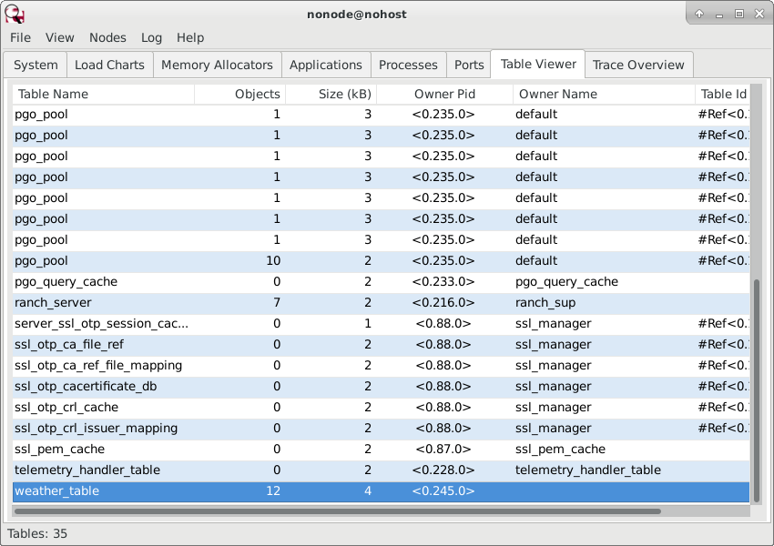
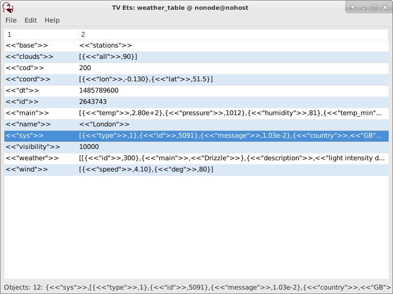

<h1>Unit 5: Web Services</h1>

*Robert Laing*

This tutorial goes into the common task of getting data from another website &mdash; usually supplied as Json, but
sometimes XML &mdash; and then parsing it and rendering it on your site.

To get data from a service provider, we need a web client, which the standard OTP application 
<a href="http://erlang.org/doc/apps/inets/http_client.html">inets</a>
includes as <a href="http://erlang.org/doc/apps/inets/http_client.html">httpc</a>. 
To access `https://...` sites, httpc needs Erlang's 
secure socket layer <a href="https://erlang.org/doc/man/ssl.html">ssl</a> application.

I picked <var>inets</var> and its <var>httpc</var> client before doing <a href="https://github.com/roblaing/erlang-webapp-howto/tree/master/unit7">
Unit 7</a> which uses <em>websocket</em>. This required using a third-party web client, 
<a href="https://github.com/ninenines/gun">Gun</a>, created as an alternative web client by the same 99s team which created <em>Cowboy</em> 
as an alternative web server.

For HTTP/1.1 it doesn't make much difference if you use OTP's included <var>httpc</var> module or the third party <var>gun</var> module, but
for websocket and HTTP/2 you need gun, so I've included the alternative code for <var>gun</var> below.

We also need a Json parser &mdash; which means adding a third-party application to the dependency list &mdash; and 
an XML parser which comes included.

Achieving this exercise required expanding the applications list in 
<a href="https://github.com/roblaing/erlang-webapp-howto/blob/master/unit5/apps/unit5/src/unit5.app.src">
apps/unit5/src/unit5.app.src</a> with many new additions:

```erlang
  {applications,
   [ kernel
   , stdlib
   , inets
   , ssl
   , cowboy
   , pgo
   , jsx
   , xmerl
   , tempo
   ]},
```

Adding inets to the above list automatically creates an httpc process when the `unit5` application is started. 
(One of the things that makes inets's httpd application confusing is it isn't started unless you make edits to explicitly include it.)

If you use gun instead of httpc, you obviously need to replace inets with gun in the above list. 
Erlang's standard library doesn't include a Json parser, so we need to pick one of the many third-party libraries available.
I'm going with <a href="https://github.com/talentdeficit/jsx">jsx</a> which is easy to add as dependency because 
<a href="https://hex.pm/">https://hex.pm/</a> is the default depot for OTP applications, meaning we don't need extra 
information on how to get them from their github or wherever homes.

The standard library also doesn't include a way to convert the conventional way of representing time as data &mdash; 
the number of seconds since the start of 1970 &mdash; to a human
readable string. For this I'm going to use a third-party application <a href="https://github.com/selectel/tempo">tempo</a>.

The edits required in <a href="https://github.com/roblaing/erlang-webapp-howto/blob/master/unit5/rebar.config">rebar.config</a> are:

```erlang
{deps, [ {cowboy, {git, "https://github.com/ninenines/cowboy.git", {branch, "master"}}}
       , {pgo, {git, "https://github.com/tsloughter/pgo.git", {branch, "master"}}}
       , jsx
       , {tempo, {git, "https://github.com/selectel/tempo", {branch, "master"}}}
       ]
}.
```

If using <var>gun</var> instead of <var>httpc</var> you also need to include

```erlang
{gun, {git, "https://github.com/ninenines/gun", {branch, "master"}}}
```

<h3>Caching</h3>

I'm using <a href="https://openweathermap.org">openweathermap.org</a> which offers free accounts, but registering can
be skipped by using its test URL as I'll do here, which provides data for London which is a couple of years old. 

You'll need to register for a free account (giving you a unique <code>appid=<hexstring></code>) to make this exercise more
interesting by giving you weather forecasts for wherever you live.

OpenWeather, like all data providers, asks users not to bombard its servers with constant requests, as could happen if `httpc:request(URL)`
was placed in the web page handler of a busy site.

Besides being polite to your data provider, fetching new data in the backround while presenting the freshest available
data from RAM to your site's visitors makes it load far quicker.

Ideally we need a type of cron job that updates the cache with fresh data with at least 10 minute gaps as requested by OpenWeather,
and Erlang has several third-party applications including <a href="https://github.com/erlware/erlcron">erlcron</a>
for this kind of service,
but for now I'll write a helper function in my webutil module, get_json(), which will be called once when the application starts.

In this tutorial I'm introducing Erlang Term Storage, <a href="https://erlang.org/doc/man/ets.html">ets</a>,
to cache the data downloaded from OpenWeather so it can be rendered any number of times without needing
another download from the data provider.

I intend to explore Erlang's caching options further in a later unit.  The ASCIIChan project in 
<a href="https://github.com/roblaing/erlang-webapp-howto/tree/master/unit3">Unit 3</a>, for instance, could probably be improved
by getting the handler to access the list of art from a cache instead of making an SQL request every time, and updating the cache
whenever fresh art is added to the database.

<h3>Json</h3>

From the erl command line, if you run 
```erlang
inets:start().  % Done automatically if inets added to the list of applications in resource file.
ssl:start().    % I only discovered I needed this after getting an error for leaving it out.
{ok, {{Version, 200, ReasonPhrase}, Headers, Body}} = 
httpc:request("https://samples.openweathermap.org/data/2.5/weather?q=London,uk&appid=b6907d289e10d714a6e88b30761fae22"),
io:format("Body: ~p~n", [Body]).
```
This will show `Body` to be a string containing Json, so lots of escaped double quotes inside the bounding double quotes,
which can be gotten rid of in the output with `io:format("Body: ~s~n", [Body])`. I find the `~p` option handy when exploring so as to
show if the returned data is a string, binary, atom, map...

The alternative way using <var>gun</var> instead of <var>httpc</var> looks like:

```erlang
{ok, PID} = gun:open("samples.openweathermap.org", 443),
StreamRef = gun:get(PID, "/data/2.5/weather?q=London,uk&appid=b6907d289e10d714a6e88b30761fae22"),
{ok, Body} = gun:await_body(PID, StreamRef),
io:format("Body: ~p~n", [Body]).
```

Using <a href="https://jsonlint.com/">https://jsonlint.com</a> to neaten up the indentation, the returned Json looks like:

```json
{
	"coord": {
		"lon": -0.13,
		"lat": 51.51
	},
	"weather": [{
		"id": 300,
		"main": "Drizzle",
		"description": "light intensity drizzle",
		"icon": "09d"
	}],
	"base": "stations",
	"main": {
		"temp": 280.32,
		"pressure": 1012,
		"humidity": 81,
		"temp_min": 279.15,
		"temp_max": 281.15
	},
	"visibility": 10000,
	"wind": {
		"speed": 4.1,
		"deg": 80
	},
	"clouds": {
		"all": 90
	},
	"dt": 1485789600,
	"sys": {
		"type": 1,
		"id": 5091,
		"message": 0.0103,
		"country": "GB",
		"sunrise": 1485762037,
		"sunset": 1485794875
	},
	"id": 2643743,
	"name": "London",
	"cod": 200
}
```

`jsx:decode(Json)` barfs if the input text isn't binary, so `Json = list_to_binary(Body)` is needed to produce
this <a href="https://erlang.org/doc/man/proplists.html">proplist</a>:

```erlang
[{<<"coord">>,[{<<"lon">>,-0.13},{<<"lat">>,51.51}]},
 {<<"weather">>,
  [[{<<"id">>,300},
    {<<"main">>,<<"Drizzle">>},
    {<<"description">>,<<"light intensity drizzle">>},
    {<<"icon">>,<<"09d">>}]]},
 {<<"base">>,<<"stations">>},
 {<<"main">>,
  [{<<"temp">>,280.32},
   {<<"pressure">>,1012},
   {<<"humidity">>,81},
   {<<"temp_min">>,279.15},
   {<<"temp_max">>,281.15}]},
 {<<"visibility">>,10000},
 {<<"wind">>,[{<<"speed">>,4.1},{<<"deg">>,80}]},
 {<<"clouds">>,[{<<"all">>,90}]},
 {<<"dt">>,1485789600},
 {<<"sys">>,
  [{<<"type">>,1},
   {<<"id">>,5091},
   {<<"message">>,0.0103},
   {<<"country">>,<<"GB">>},
   {<<"sunrise">>,1485762037},
   {<<"sunset">>,1485794875}]},
 {<<"id">>,2643743},
 {<<"name">>,<<"London">>},
 {<<"cod">>,200}]
```

<h3>XML</h3>

If you want XML instead of Json, Open Weather provides the `mode=xml` option in the URL's query string:
```
httpc:request("https://samples.openweathermap.org/data/2.5/weather?q=London,uk&mode=xml&appid=b6907d289e10d714a6e88b30761fae22").
```
The body of this request is again a string, but containing XML, which pretty printed looks like this:

```xml
<?xml version="1.0" encoding="UTF-8"?>
<current>
   <city id="2643743" name="London">
      <coord lon="-0.13" lat="51.51" />
      <country>GB</country>
      <sun rise="2017-01-30T07:40:36" set="2017-01-30T16:47:56" />
   </city>
   <temperature value="280.15" min="278.15" max="281.15" unit="kelvin" />
   <humidity value="81" unit="%" />
   <pressure value="1012" unit="hPa" />
   <wind>
      <speed value="4.6" name="Gentle Breeze" />
      <gusts />
      <direction value="90" code="E" name="East" />
   </wind>
   <clouds value="90" name="overcast clouds" />
   <visibility value="10000" />
   <precipitation mode="no" />
   <weather number="701" value="mist" icon="50d" />
   <lastupdate value="2017-01-30T15:50:00" />
</current>
```
The following magic incantations:

```erlang]
...
{Element, _} = xmerl_scan:string(Body),
{_, _, XML} = xmerl_lib:simplify_element(Element),
Content = io_lib:format("~p~n", [XML]),
...
```

produces this proplist with some key differences to the Json version:

```erlang
[{city,[{id,"2643743"},{name,"London"}],
       [{coord,[{lon,"-0.13"},{lat,"51.51"}],[]},
        {country,[],["GB"]},
        {sun,[{rise,"2017-01-30T07:40:36"},{set,"2017-01-30T16:47:56"}],[]}]},
 {temperature,[{value,"280.15"},{min,"278.15"},{max,"281.15"},{unit,"kelvin"}],
              []},
 {humidity,[{value,"81"},{unit,"%"}],[]},
 {pressure,[{value,"1012"},{unit,"hPa"}],[]},
 {wind,[],
       [{speed,[{value,"4.6"},{name,"Gentle Breeze"}],[]},
        {gusts,[],[]},
        {direction,[{value,"90"},{code,"E"},{name,"East"}],[]}]},
 {clouds,[{value,"90"},{name,"overcast clouds"}],[]},
 {visibility,[{value,"10000"}],[]},
 {precipitation,[{mode,"no"}],[]},
 {weather,[{number,"701"},{value,"mist"},{icon,"50d"}],[]},
 {lastupdate,[{value,"2017-01-30T15:50:00"}],[]}]
```

<h2>Routing</h2>

We need to modify our <a href="https://github.com/roblaing/erlang-webapp-howto/blob/master/unit5/apps/unit5/src/unit5_app.erl">
apps/myproject/src/myproject_app.erl</a> to include the following new route in the list:

```erlang
     ...
     , {"/weather"       , weather_handler, []}
     ...
```

This implies a <a href="https://github.com/roblaing/erlang-webapp-howto/blob/master/unit5/apps/unit5/src/weather_handler.erl">
weather_handler.erl</a> file which I'll get to shortly.

<h2>Adding ETS</h2>

Besides the router, we need to add a few other lines to our `<myproject>`_app.erl file to start and register an ETS table, 
and then free the memory it used when the application stops.

```erlang
-module(unit5_app).
-behaviour(application).
-export([start/2, stop/1]).

start(_StartType, _StartArgs) ->
  ets:new(weather_table, [public, named_table]),
  Dispatch = cowboy_router:compile(
   [{'_', 
     [ {"/"              , cowboy_static, {priv_file, unit5, "index.html"}}
     , {"/weather"       , weather_handler, []}
     , {"/styles/[...]"  , cowboy_static, {priv_dir,  unit5, "styles"}}
     , {"/scripts/[...]" , cowboy_static, {priv_dir,  unit5, "scripts"}}
     ] 
    }
   ]
  ),
  persistent_term:put(unit4_routes, Dispatch),
  cowboy:start_clear(unit4_http_listener,
   [{port, 3030}],
   #{env => #{dispatch => {persistent_term, unit4_routes}}}
  ),
  webutil:get_json(),
  unit4_sup:start_link().

stop(_State) ->
  ets:delete(weather_table),  
  ok = cowboy:stop_listener(unit4_http_listener).
```

Note the first line of code in the start/2 function is 
<a href="https://erlang.org/doc/man/ets.html#new-2">ets:new(Name, Options) -> tid() | atom()</a>.

The default `type` option `set` is what I think I want (it implies no duplicate keys). 

I'm guessing the default `protection` option needs to be changed to `public` so that processes outside
of process launched by start can manipulate values.

The `named_table` option means whatever name I give my ETS table gets 
<a href="http://erlang.org/doc/man/erlang.html#register-2">registered</a>, ie its process ID becomes a global
constant that say, `get_json()`, can be on a first name basis with it.

To make my application aware of this, I need a small edit in the application resource file.
<a href="https://github.com/roblaing/erlang-webapp-howto/blob/master/unit5/apps/unit5/src/unit5.app.src">
apps/unit5/src/unit5.app.src</a> by changing `{registered, []}.` to `{registered, [weather_table]}`.

<h3>Inserting data into the cache</h3>

I run <a href="https://github.com/roblaing/erlang-webapp-howto/blob/master/unit5/apps/unit5/src/webutil.erl">
webutil:get_json()</a> near the end of my start/2 function to get the initial data. At this stage I haven't yet explored ways
of getting the application to re-run it every hour or whenever to update the cache.

That the above data is in a proplist is handy since {Key, Value} tuples are what ETS data is stored as.
The <a href="https://erlang.org/doc/man/ets.html#insert-2">ets:insert(Table, {Key, Value}) -> true</a>
function is an exception to Erlang's immutable variable rule. If `Key` already exists, its old value gets
overwritten with the new value, making it ideal to regularly update our weather data.

We can insert the above proplist into an ETS table with this recursive function:

```erlang
proplist_to_ets(_TableId, []) -> ok;
proplist_to_ets(TableId, [{Key, Value}|Proplist]) ->
  ets:insert(TableId, {Key, Value}),
  proplist_to_ets(TableId, Proplist).
```

<h3>Json vs XML</h3>

When I started this tutorial, I was hoping to write a `get_xml()` function that would be interchangeable with
`get_json()`. While I've managed to turn both data formats supplied by OpenWeather into proplists than can 
be inserted into the ETS cache via the above helper function, unfortunately OpenWeather has made the
hierarchies of the two formats too different to make that a simple exercise.

Besides having differently named keys in the outermost layer of their respective proplists, keys from the Json data 
are binary strings while those from the XML data are atoms.

A reminder again the <a href="http://erlang.org/doc/efficiency_guide/commoncaveats.html#list_to_atom-1">
efficiency guide</a> advises against using atoms when a binary string or list will do because in Erlang 
atoms are not garbage-collected, and once an atom is created, it is never removed. 

I'm not sure if this applies to atoms in ETS tables once the table is destroyed, but it's probably a good
idea to run the XML keys and values through <a href="http://erlang.org/doc/man/erlang.html#atom_to_binary-2">atom_to_binary(Atom, utf8)</a>
before inserting them as `{Key, Value}` tuples into an ETS table.

Besides the issue of strings vs atoms, there's also the issue that the keys and values in the proplists are not identical, 
nor are the ways their trees are structured (things which are parents in the Json version are children in the XML version and vice versa).

So I'll just use the Json data in my handler.

<h2>Using Observer to View ETS tables</h2>

Erlang's Observer tool which I introduced in <a href="https://github.com/roblaing/erlang-webapp-howto/tree/master/unit2#observer">
Unit 2</a> has a tab <em>Table View</em> which looks something like this:



I found <em>weather_table</em> at the bottom of a long list I had to scroll down, partly because of the 10 <em>pgo_pool</em> ETS tables 
created when I left the default number of PostgreSQL pools started by pgo.

Double clicking on the <em>weather_table</em> will cause a window to pop up showing the contents of the ETS table 
<em>spreadsheet</em> style. Observer even lets you edit the content of the table as if it was a spreadsheet.



<h2>The handler</h2>

I haven't extracted all the data from the supplied Json, but hopefully enough to make
<a href="https://github.com/roblaing/erlang-webapp-howto/blob/master/unit5/apps/unit5/src/weather_handler.erl">
apps/unit5/src/weather_handler.erl</a> illustrative.


Getting whatever the freshest data is from the cache is fairly straightforward:

```erlang
[{<<"name">>, Name}] = ets:lookup(weather_table, <<"name">>)
```

I got tripped up by a couple of things which I'll elaborate on here.

<h3>Date formating</h3>

Much as I dislike XML, I have to credit the XML proplist for having

```xml
<lastupdate value="2017-01-30T15:50:00" />
```
in contrast to the Json version which has

```json
"dt": 1485789600
```

The "dt" key is presumably short for `datetime`, which Erlang's <a href="https://erlang.org/doc/man/calendar.html">Calendar</a>
library defines as some mysterious tuple while everyone else defines it as the number of seconds since the start of 1970.

Converting numbers like 1485789600 into to something human readable is exasperating in most programing languages, and in
Erlang more so than most.

I eventually discovered the magic incantation in tempo was 
`{ok, Date} = tempo:format(iso8601, {unix, 1485789600})` which produced `<<"2017-01-30T15:20:00Z">>`, coincidently
exactly two years from when I was writing this.

Alternatively using `rfc1123` instead of `iso8601` produces `<<"Mon, 30 Jan 2017 15:20:00 GMT">>`, and
`rfc2822` produces `<<"Mon, 30 Jan 2017 15:20:00 +0000">>`.

The tempo application is a wrapper for C's <a href="https://linux.die.net/man/3/strftime">strftime</a> function, so you can
customise as in `<<"%A, %Y-%d-%m">>` which produces `<<"Monday, 2017-30-01">>`.

<h3>Number formating</h3>

The first glitch was my html_escape(Arglist) function crashes if any elements in the Arglist are numbers. The next snag
was the supplied temperature value of 280.32 got about a dozen trailing zeroes when I converted it to Celsius by subracting
273.15.

Here I discovered Erlang's <a href="http://erlang.org/doc/man/erlang.html#float_to_list-2">float_to_list(Float, Options) -> string()</a>
which solved both problems.

Next &mdash; Unit 6: [Ajax](https://github.com/roblaing/erlang-webapp-howto/tree/master/unit6)

