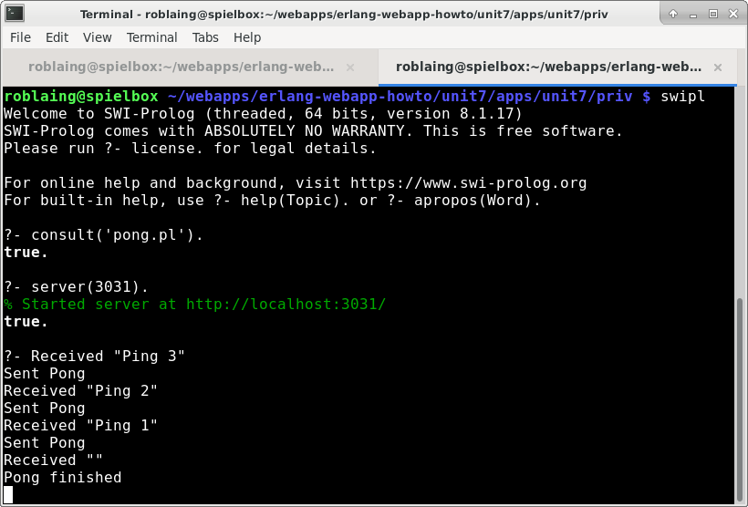
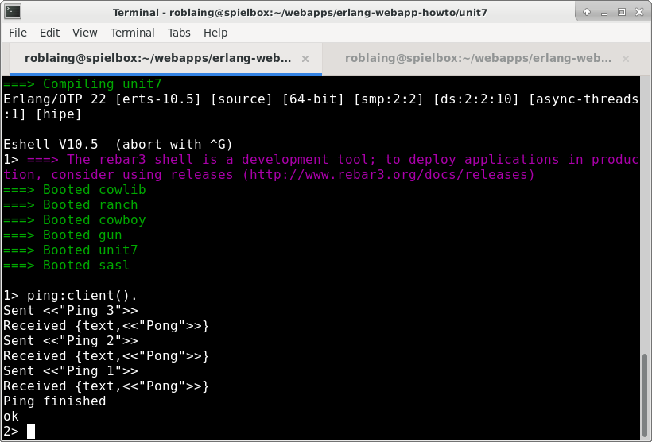
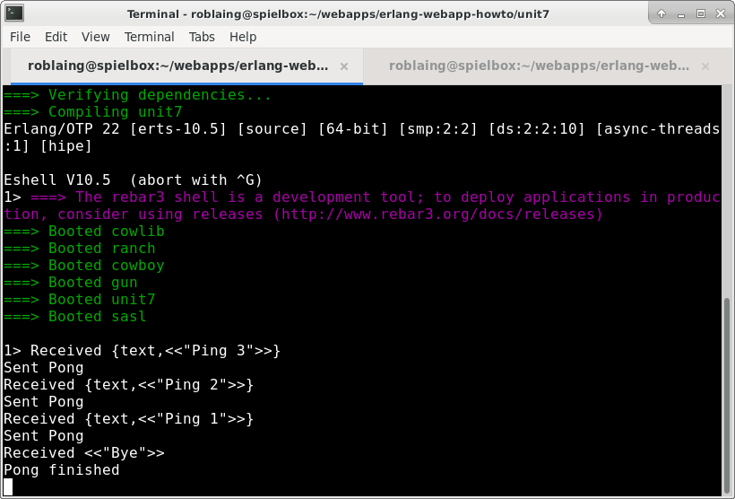
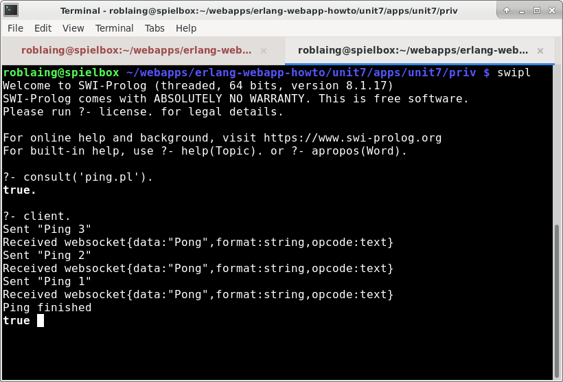

<h1>Interlanguage communication via websocket</h1>

In the story so far, I've "glued" a Javascript browser and PostgreSQL database together with an Erlang web server.

The next challenge is to use Erlang to glue on further components written in whatever language &mdash; Prolog in my example.

Hypothetically, Prolog comes glued on. One of Erlang's original creators, Robert Virding, wrote a version of Prolog called 
<a href="https://github.com/rvirding/erlog">Erlog</a>, which runs on OTP.

But I didn't get far with Erlog. The executable `bin/erlog` gave a crash report instead of launching a Prolog REPL on my machine,
which I'm guessing is because I'm using a recent OTP version, 22, whereas Erlog's documentation says it was
developed for a fairly old Erlang version.

And in any event I couldn't figure out from Erlog's sparse documentation how to use it as a "library language" from the Erlang REPL.

So instead I'm going to use the very thoroughly documented and maintained <a href="https://www.swi-prolog.org/">SWI Prolog</a>. 

The easiest way to get Erlang to interact with other programs on the same Linux machine would be with 
<a href="https://erlang.org/doc/man/os.html#cmd-1">cmd(Command) -> string()</a>. But I'm made of sterner stuff, so am going to use 
<em>websocket</em> &mdash; <a href="https://tools.ietf.org/html/rfc6455">RFC 6455</a> to its friends &mdash; 
a technology I'm completely unfamiliar with, but which is supported by just about every programing language, including
SWI Prolog, Erlang, and Javascript.

<h2>Ping-pong between Erlang and SWI Prolog</h2>

To learn the basics, I've rewritten the Erlang official documentation's introductory example of
<a href="https://erlang.org/doc/getting_started/conc_prog.html#distributed-programming">
messaging ping and pong</a> between different programs, possibly on different computers, N times.

I only subsequently read RFC 6455 far enough to learn <em>ping</em> and <em>pong</em> are an unfortunate choice of names
for an introductory websocket tutorial because they are among its few reserved words. Please note I'm just using
"ping" and "pong" as arbitrary call and response text here, not as frame control opcodes as eplained in
<a href="https://tools.ietf.org/html/rfc6455#section-5.5.2">ping</a> and
<a href="https://tools.ietf.org/html/rfc6455#section-5.5.3">pong</a>.

<h2>Prolog server, Erlang client</h2>

In the first example, I'm using Erlang as my websocket client and SWI Prolog as my websocket server. 
The reason is my longer term ambition is to be able to query a Prolog database from another language 
via a socket as one can SQL databases. I've added an example of switching this around, using Erlang
as the server and SWI Prolog as the client, after this.

Just as the <em>99s</em> team have written Cowboy as a replacement for the builtin library inets's 
<a href="http://erlang.org/doc/apps/inets/http_server.html">httpd</a>, they have written
<a href="https://ninenines.eu/docs/en/gun/2.0/guide/">Gun</a> as a replacement for inets's
<a href="http://erlang.org/doc/apps/inets/http_client.html">httpc</a>.
Whereas Erlang's builtin client httpc only handles HTTP/1.1, Gun can be used as a client for websocket and HTTP/2.

This means adding another dependency to 
<a href="https://github.com/roblaing/erlang-webapp-howto/blob/master/unit7/rebar.config">rebar.config</a>:

```erlang
...
       , {gun, {git, "https://github.com/ninenines/gun", {branch, "master"}}}
...
```

and rembering to also add it to the applications list in the application resource file,
<a href="https://github.com/roblaing/erlang-webapp-howto/blob/master/unit7/apps/unit7/src/unit7.app.src">
apps/unit7/src/unit7.app.src</a>

Once I'd figured things out, the required code for both the client and server was fairly short, and what
the program does is fairly dull &mdash; just prints out ping and pong messages on the respective terminals
that Erlang and SWI Prolog are running on. 

For the impatient, I'll start with the finished SWI Prolog server code,
<a href="https://github.com/roblaing/erlang-webapp-howto/blob/master/unit7/apps/unit7/priv/pong.pl">
apps/unit7/priv/pong.pl</a> and push the notes I took as I figured things out to the bottom.

```prolog
:- use_module(library(http/websocket)).
:- use_module(library(http/thread_httpd)).
:- use_module(library(http/http_dispatch)).

:- http_handler(root(pong), http_upgrade_to_websocket(pong_handler, []), [spawn([])]).

server(Port) :-
  http_server(http_dispatch, [port(Port)]).

pong_handler(Request) :-
  ws_receive(Request, Message),
  debug(websocket, "Got ~p~n", [Message]),
  format("Received ~p~n", [Message.data]),
  (   Message.opcode == close
  ->  ws_send(Request, close(1000, "Bye")),
      format("Pong finished~n")
  ;   ws_send(Request, text("Pong")),
      format("Sent Pong~n"),
      pong_handler(Request)
  ).
```

Loading this from the swipl REPL can be done by `consult('pong.pl').` assuming you are in the same directory as
the file, and then firing up the server with `server(3031)` or whatever you want to use as a port number.

A handy feature in SWI Prolog I only recently discovered are its debug messages. To switch this on,
enter `debug(websocket).` since websocket is the name given in `debug(websocket, "Got ~p~n", [Message]),`
to view what the server is receiving from the client.

After the Erlang client has been run, your terminal screen should look something like:



The Erlang client
<a href="https://github.com/roblaing/erlang-webapp-howto/blob/master/unit7/apps/unit7/src/ping.erl">
apps/unit7/src/ping.erl</a> looks like:

```erlang
-module(ping).
-export([client/0, ping/3]).

client() ->
  {ok, Pid} = gun:open("localhost", 3031),
  {ok, _} = gun:await_up(Pid),
  StreamRef = gun:ws_upgrade(Pid, "/pong"),
  {upgrade, [<<"websocket">>], _} = gun:await(Pid, StreamRef),
  ping(3, Pid, StreamRef),
  gun:shutdown(Pid).

ping(0, _, _) ->
  io:format("Ping finished~n", []);
  
ping(N, Pid, StreamRef) ->
  Message = list_to_binary(io_lib:format("Ping ~s", [integer_to_list(N)])),
  io:format("Sent ~p~n", [Message]),
  gun:ws_send(Pid, [{text, Message}]),
  {ws, Frame} = gun:await(Pid, StreamRef),
  io:format("Received ~p~n", [Frame]),
  ping(N - 1, Pid, StreamRef).
```

After running `rebar3 release` and then `rebar3 shell` calling the client from the erl REPL
as `ping:client().` should produce something like:




<h3>The ping (Erlang) websocket client</h3>

To "upgrade" from plain vanilla http/1.1 to websocket the client and server have to perform an
<a href="https://tools.ietf.org/html/rfc6455#section-1.3">opening handshake</a>.

Doing this with Gun requires calling the following functions in this order:

<h4>Step 1: Open connection</h4>

<a href="https://ninenines.eu/docs/en/gun/2.0/manual/gun.open/">
gun:open(Host, Port, Opts) -> {ok, pid()} | {error, Reason}</a>

In my example, I'm going to call

```erlang
  {ok, Pid} = gun:open("localhost", 3031),
```

With the SWI Prolog websocket server's port set to 3031 (keeping my Erlang http server's port as 3030).

<h4>Step 2: Ask for an upgrade to websocket</h4>

<a href="https://ninenines.eu/docs/en/gun/2.0/manual/gun.await_up/">
gun:await_up(ConnPid, Timeout, MonitorRef) -> {ok, Protocol} | {error, Reason}</a>

If Timeout is left out, it defaults to 5000 miliseconds and MonitorRef is automatically created by Gun.

I'll be using a shortened version with the default 5 second timeout:

```erlang
  {ok, _} = gun:await_up(Pid),
```
The ignored Protocol returned variable in this case would be <em>http</em>. Other servers might return <em>http2</em> or <em>sockets</em>.

<h4>Step 3: Upgrade to websocket</h4>

<a href="https://ninenines.eu/docs/en/gun/2.0/manual/gun.ws_upgrade/">
gun:ws_upgrade(ConnPid, Path, Headers, WsOpts) -> StreamRef</a>

Path is the route set up on the SWI Prolog server, so in this example I'll call `"/pong"`, so with port 3031 selected, the
server's URL would be `ws://localhost:3031/pong`

If I wanted to include http request headers such as the following taken from the example in the RFC:

```http
Sec-WebSocket-Protocol: chat, superchat
Sec-WebSocket-Version: 13
```

I would make Headers a proplist:

```erlang
[ {<<"sec-websocket-protocol">>, <<"chat, superchat">>}
, {<<"sec-websocket-version">>, <<"13">>}
]
```

WsOpts is a map, and an example in the documentation is `#{compress => false}`.

In my case, I'm not using extra headers or options, so this can be abreviated to:

```erlang
  StreamRef = gun:ws_upgrade(Pid, "/pong"),
```

StreamRef looks something like `#Ref<0.596962980.3933732865.48581>`

<h4>Step 4: Get response from server</h4>

<a href="https://ninenines.eu/docs/en/gun/2.0/manual/gun.await/">
gun:await(ConnPid, StreamRef, Timeout, MonitorRef) -> Result</a>

As with gun:await_up in Step 2, Timeout and MonitorRef can be left out (setting a default timeout of 5 seconds).

```erlang
  {upgrade, [<<"websocket">>], _Headers} = gun:await(Pid, StreamRef),
```

The ignored third element in the Result tuple looks something like:

```erlang
[ {<<"upgrade">>,<<"websocket">>}
, {<<"connection">>,<<"Upgrade">>}
, {<<"sec-websocket-accept">>,<<"XXw/nNAZ45OQePJ6JBRRoiRH3qk=">>}
]
```

Indicating the server responded with an http header something like this:

```http
HTTP/1.1 101 Switching Protocols
Upgrade: websocket
Connection: Upgrade
Sec-WebSocket-Accept: XXw/nNAZ45OQePJ6JBRRoiRH3qk=
```

and we've completed our opening handshake.

<h4>Step 5: Send pings, receive pongs</h4>

<a href="https://ninenines.eu/docs/en/gun/2.0/manual/gun.ws_send/">
ws_send(ConnPid, Frames) -> ok</a>

In my example

```erlang
  gun:ws_send(Pid, [{text, <<"Sent Ping 1">>}]),
```

Besides <em>text</em> the first argument in the Frames tuple can be <em>binary</em> to denote the data type
in the second argument.

Putting {text, <<"Sent Ping 1">>} in a list is optional, but it makes it clearer this could be a list such as
`[{text, <<"Sent Ping 2">>},{text, <<"Sent Ping 1">>}, close]`

The reserved word,
<a href="https://tools.ietf.org/html/rfc6455#section-5.5.1">close</a> is used in the final Step 6.

The pong response from the server is received by gun:await/2 which we already met in Step 4. The difference here
is the result tuple looks like `{ws, Frame}` instead of `{upgrade, Protocols, Headers}`.

```erlang
  {ws, Frame} = gun:await(Pid, StreamRef),
```

<h4>Step 6: Close the connection</h4>

The Gun User Guide uses
<a href="https://ninenines.eu/docs/en/gun/2.0/manual/gun.close/">gun:close(ConnPid)</a>
which it warns will "brutally close the connection".

What this does on the SWI Prolog server side is cause it to barf

```prolog
% [Thread 9] Got websocket{data:end_of_file,opcode:close}
ERROR: [Thread 9] Socket error: Broken pipe
```

so lets rather end with
```erlang
  gun:ws_send(Pid, close).
```
or better yet, the
<a href="https://tools.ietf.org/html/rfc6455#section-7.4.1">1000 normal closure</a> code
with whatever closing text.
```erlang
  gun:ws_send(Pid, {close, 1000, <<"Bye">>}).
```

which the server responds to with
```prolog
% [Thread 9] Got websocket{code:1000,data:"Bye",format:string,opcode:close}
```
and no error messages.

I've used <a href="https://ninenines.eu/docs/en/gun/2.0/manual/gun.shutdown/">shutdown(ConnPid) -> ok</a>
which sends the server a close opcode and waits for a responding close message before closing the stream.

<h3>The pong (SWI Prolog) websocket server</h3>

<h4>Step 1: Create an http server</h4>

Writing a websocket server in prolog is not very different from a plain vanilla http/1.1 server, which I've written
<a href="https://github.com/roblaing/swipl-webapp-howto">tutorials</a> on.

SWI Prolog's <a href="https://www.swi-prolog.org/pldoc/doc/_SWI_/library/http/thread_httpd.pl">thread_http</a>
library has a function `http_server(:Goal, :Options)` which achieves this in a few lines of code:

```prolog
:- use_module(library(http/thread_httpd)).
:- use_module(library(http/http_dispatch)).

start_server(Port) :-
    http_server(http_dispatch, [port(Port)]).
```

<h4>Step 2: Link a route to a handler</h4>

The <a href="https://www.swi-prolog.org/pldoc/man?section=httpdispatch">http_dispatch</a> library in turn has a function
<a href="https://www.swi-prolog.org/pldoc/doc_for?object=http_handler/3">http_handler(+Path, :Closure, +Options)</a>
to link routes and handlers.

To make `/pong` a route, set the first argument `+PATH` to `root(pong)`. Alternatively that could be written `'/pong'`,
but using SWI Prolog's <a href="https://www.swi-prolog.org/pldoc/man?section=httppath">path abstraction</a> as in `root(pong)`
seems to be the preferred style with security advantages.

Usually the second argument, `:Closure`, would be something like `my_handler` without any arguments, refering to a predicate

```prolog
my_handler(Request) :-
  ...
```
where <em>Request</em> contains the key-value pairs from the http header in the Prologish format of `[key1(value1), key2(value2),...]`

But to "upgrade" from plain vanilla http/1.1 to webserver, we don't directly set `:Closure` to `my_handler`, but instead fill that slot with
<a href="https://www.swi-prolog.org/pldoc/doc_for?object=http_upgrade_to_websocket/3">http_upgrade_to_websocket(:Goal, +Options, +Request)</a>
which is part of the <a href="https://www.swi-prolog.org/pldoc/man?section=websocket">websocket</a> library, meaning we must add near the top
of the file:

```prolog
:- use_module(library(http/websocket)).
```
The first argument in http_upgrade_to_websocket, `:Goal`, is now where `my_handler` goes, and its third argument, `+Request`, 
vanishes here but magically reappears later in `my_handler(Request) :- ...`.

The http_handler's third argument, `+Options` is set to `[spawn([])]`, causing `my_handler` to be run in a separate thread.

Pulling this together for my example, my route-handler combo looks like:

```prolog
:- http_handler(root(pong), http_upgrade_to_websocket(pong_handler,[]), [spawn([])]).
```

<h4>Step 3: Write the handler</h4>

SWI Prolog's websocket library has 
<a href="https://www.swi-prolog.org/pldoc/doc_for?object=ws_receive/3">ws_receive(+Request, -Message:dict, +Options)</a>
which is similar to `{ws, Frame} = gun:await(Pid, StreamRef)`, and
<a href="https://www.swi-prolog.org/pldoc/doc_for?object=ws_send/2">ws_send(+Request, +Frames)</a> which is similar
to `gun:ws_send(Pid, Frames)`.

Though Erlang's ancestry is Prolog, its proplists with curly bracketed tuples don't fit into the Prolog convention. 
While we don't need to translate their respective websocket frames, flipping between the server and client code
requires one to remember the difference:

<table>
<tr><th>Prolog Frames</th><th>Erlang Frames</th></tr>
<tr><td>[text("Ping 2"), text("Ping 1"), close(1000, "Bye")]</td>
    <td>[{text, <<"Ping 2">>}, {text, <<"Ping 1">>}, {close, 1000, <<"Bye">>}]</td>
</tr>
</table>

An alternative to `text` supported by both SWI Prolog and Gun is `binary`. Whereas SWI Prolog allows `string` as a synonym
for `text`, and gives the options of `json`, `prolog` and SWI Prolog dictionaries, they are not supported by Gun.

Substituting `{text, <<"Ping 1">>}` with `{binary, <<"Ping 1">>}` on the Erlang side
and `text("Pong")` with `binary("Pong")` on the Prolog side works fine, and may be more efficient.

The second argument of `ws_receive`, `-Message:dict`, is a SWI Prolog dictionary which looks like
`websocket{data:"Hello!", format:string, opcode:text}`.

RFC 6455 lists six <a href="https://tools.ietf.org/html/rfc6455#section-11.8">opcodes</a>, each of which has a literal and a
hexadecimal value:

<table>
<tr><th>Hex</th><th>Name</th></tr>
<tr><td>0</td><td>continuation</td></tr>
<tr><td>1</td><td>text</td></tr>
<tr><td>2</td><td>binary</td></tr>
<tr><td>8</td><td>close</td></tr>
<tr><td>9</td><td>ping</td></tr>
<tr><td>A</td><td>pong</td></tr>
</table>

The unused 3-7 and B-F are reserved for the time being.

(A reminder again, the ping and pong opcodes are not related to the arbitrary text getting sent back and forth in this simple
example).

The only important opcode in this simple example is `close` which breaks the recursive listening loop:

```prolog
pong_handler(Request) :-
  ws_receive(Request, Message),
  debug(websocket, "Got ~p~n", [Message]),
  format("Received ~p~n", [Message.data]),
  (   Message.opcode == close
  ->  ws_send(Request, close(1000, "Bye")),
      format("Pong finished~n")
  ;   ws_send(Request, text("Pong")),
      format("Sent Pong~n"),
      pong_handler(Request)
  ).
```

<h2>Erlang server, Prolog client</h2>

Following the above, I proceeded to flip the problem around, making Erlang (using Cowboy) the server and SWI Prolog the client.

I battled to understand the documentation for
<a href="https://ninenines.eu/docs/en/cowboy/2.7/manual/cowboy_websocket/">cowboy_websocket</a>, but kinda got
<a href="https://github.com/roblaing/erlang-webapp-howto/blob/master/unit7/apps/unit7/src/pong_handler.erl">
apps/unit7/src/pong_handler.erl</a> to work as follows.

```erlang
-module(pong_handler).
-behaviour(cowboy_websocket).

-export([ init/2
        , websocket_handle/2
        , websocket_info/2
        , terminate/3
        ]
).

init(Req, State) ->
  {cowboy_websocket, Req, State}.

% Responds to Frames from client
% InFrame    :: ping | pong | {text | binary | ping | pong, binary()}
websocket_handle(InFrame, State) ->
  io:format("Received ~p~n", [InFrame]),
  io:format("Sent Pong~n", []),
  {[{text, <<"Pong">>}], State}.

% This has to be here, but isn't used.
websocket_info(_Info, State) ->
  {[], State}.

terminate({remote, Code, Message}, _PartialReq, _State) -> 
  io:format("Received ~p ~p~n", [Code, Message]),
  io:format("Pong finished~n", []),
  ok.
```

Something that tripped me up was websocket_handle/2 ignores the `close` opcode (it does however accept 
the `ping` and `pong` opcodes), leaving it to the cowboy_websocket behaviour's <em>optional</em>
`terminate(Reason, PartialReq, State) -> ok` with Reason = `{remote, cow_ws:close_code(), binary()}`
if the client sends 1000 or whatever closing code and a "Bye" or whatever message.

The cowboy_websocket behaviour also has an <em>optional</em> `websocket_init(State) -> CallResult`
which I've left out.

If I wanted the server instead of the client to initiate messaging, I could do it with something like
this example based on the Cowboy User Guide's
<a href="https://ninenines.eu/docs/en/cowboy/2.7/guide/ws_handlers/#_post_upgrade_initialization">
post-upgrade initialization</a> section:

```erlang
websocket_init(State) ->
  {[{text, <<"Ping">>}], State}.
```

There is a <em>required</em> `websocket_info(Info, State) -> CallResult` whose purpose I
can't figure out from the explanation in the
<a href="https://ninenines.eu/docs/en/cowboy/2.7/guide/ws_handlers/#_receiving_erlang_messages">
Receiving Erlang messages</a> section since I'm not sure who supplies `Info`.



The SWI Prolog client
<a href="https://github.com/roblaing/erlang-webapp-howto/blob/master/unit7/apps/unit7/priv/ping.pl">
apps/unit7/priv/ping.pl</a> is very similar to its Erlang equivalent (probably a bit more elegant because
I have many more hours of SWI Prolog under my belt).

```prolog
:- use_module(library(http/websocket)).

client :-
  http_open_websocket('ws://localhost:3030/pong', Request, []),
  debug(websocket, "Got ~p~n", [Request]),
  ping(3, Request),
  ws_close(Request, 1000, "Bye").

ping(0, _) :-
  format("Ping finished~n", []).

ping(N, Request) :-
  format(string(Message), "Ping ~d", [N]),
  format("Sent ~p~n", [Message]),
  ws_send(Request, text(Message)),
  ws_receive(Request, Frames),
  format("Received ~p~n", [Frames]),  
  succ(M, N),
  ping(M, Request).
```



<h2>Basic Prolog server daemon</h2>

Going back to using Prolog as a server, I've addapted the first simple example to a first step in using SWI Prolog
as a daemon which can respond to queries via websocket akin to how SQL databases do.

My exploration of Erlog re-introduced me to the 
<a href="https://github.com/roblaing/erlang-webapp-howto/blob/master/unit7/apps/unit7/priv/family.pl">family database</a> 
in the introductory example in Ivan Bratko's textbook <em>Prolog Programming for Artificial Intelligence</em> which I'm 
going to use as my example database here.

An addaption I've made from the top example is to run the Prolog database as a Unix daemon using the
<a href="https://www.swi-prolog.org/pldoc/doc/_SWI_/library/http/http_unix_daemon.pl">http_unix_daemon</a>
library.

Instead of printing things to a console, I now start the Prolog server with

```bash
swipl ws_server.pl --port=3031 --pidfile=http.pid --workers=4
```

and stop it with

```bash
kill $(cat http.pid)
```

My <a href="https://github.com/roblaing/erlang-webapp-howto/blob/master/unit7/apps/unit7/priv/ws_server.pl">
ws_server.pl</a> file looks like:

```prolog
:- use_module(library(http/websocket)).
:- use_module(library(http/http_unix_daemon)).

:- initialization http_daemon.

:- consult('family.pl').

:- http_handler(root(family), http_upgrade_to_websocket(family_handler, []), [spawn([])]).

family_handler(Request) :-
  ws_receive(Request, Message),
  (   Message.opcode == close
  ->  ws_send(Request, close(1000, "normal closure"))
  ;   query(Message.data, Answer),
      ws_send(Request, binary(Answer)),
      family_handler(Request)
  ).

query(QueryString, AnswerString) :-
  term_string(Term, QueryString, [variable_names(VNames)]),
  call(Term),
  last(VNames, Answer),
  term_string(Answer, AnswerString).
```

My Erlang client <a href="https://github.com/roblaing/erlang-webapp-howto/blob/master/unit7/apps/unit7/src/prolog_query.erl">
prolog_query.erl</a> to run some queries via websocket looks like:

```erlang
-module(prolog_query).
-export([client/0, pl_query/3]).

client() ->
  {ok, Pid} = gun:open("localhost", 3031),
  {ok, _} = gun:await_up(Pid),
  StreamRef = gun:ws_upgrade(Pid, "/family"),
  {upgrade, [<<"websocket">>], _} = gun:await(Pid, StreamRef),
  Q1 = <<"findall(Parent, parent(Parent, bob), Parents)">>,
  io:format("Asked ~p~n", [Q1]),
  io:format("Answer ~p~n", [pl_query(Q1, Pid, StreamRef)]),
  Q2 = <<"findall(Child, parent(bob, Child), Children)">>,
  io:format("Asked ~p~n", [Q2]),
  io:format("Answer ~p~n", [pl_query(Q2, Pid, StreamRef)]),
  gun:shutdown(Pid).

pl_query(Prolog, Pid, StreamRef) ->
  gun:ws_send(Pid, [{binary, Prolog}]),
  {ws, {binary, Answer}} = gun:await(Pid, StreamRef),
  Answer.
```

Running `prolog_query:client().` from `rebar3 shell` produces:

```erlang
1> prolog_query:client().
Asked <<"findall(Parent, parent(Parent, bob), Parents)">>
Answer <<"'Parents'=[pam,tom]">>
Asked <<"findall(Child, parent(bob, Child), Children)">>
Answer <<"'Children'=[ann,pat]">>
ok
2> 
``` 

